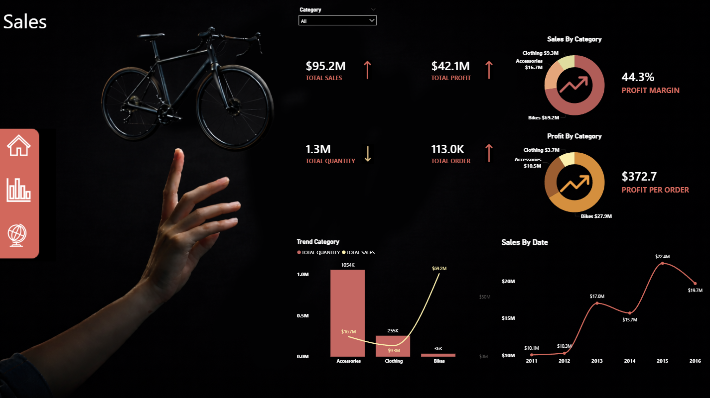
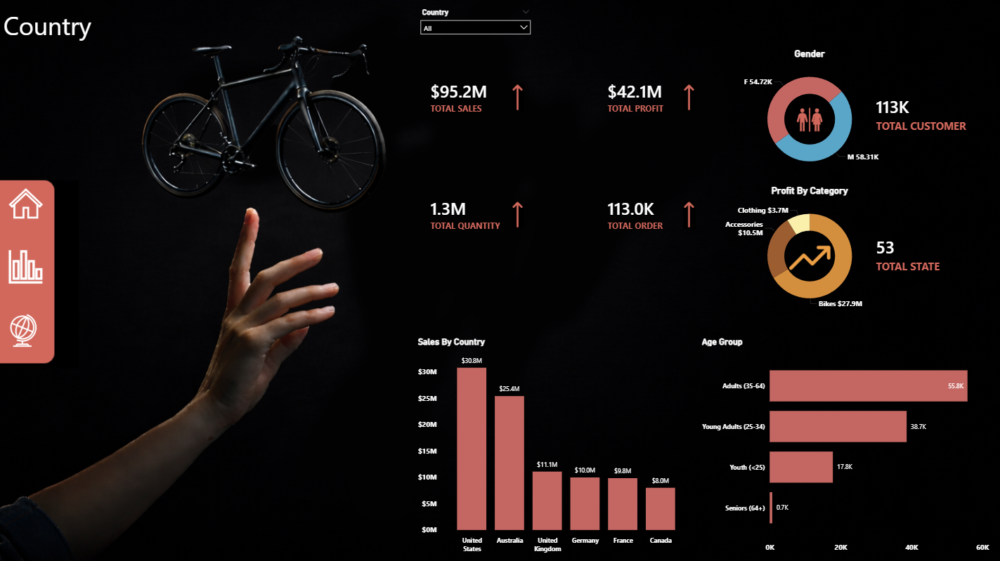

🚲 Bike Sales Performance Dashboard | Power BI

📌 Project Overview
This project delivers a complete end-to-end Power BI dashboard designed to analyze
bike sales performance and support data-driven decision-making.
The dashboard provides a clear view of sales trends, customer behavior,
profitability, and regional performance.

---

🎯 Business Objectives
- Evaluate overall sales and profit performance
- Identify top-performing product categories
- Understand customer demographics and buying behavior
- Analyze sales performance across countries and regions
- Track sales and profit trends over time

---

❓ Key Business Questions
- How much total revenue and profit has been generated?
- Which product categories drive the highest sales and profit?
- Who are the most valuable customer segments?
- Which countries contribute the most to total sales?
- How do sales and profit change year over year?

---

🗂 Data Description
- Bike sales dataset including:
  - Customer demographics (age, gender, income)
  - Product categories (bikes, accessories, clothing)
  - Sales transactions (quantity, revenue, profit)
  - Geographic information (country, state)
- Data cleaning and transformation were performed using **Power Query**.

---

🛠 Tools & Technologies
- **Power BI**
- **Power Query**
- **DAX**
- **Excel** (Data Source)

---

📊 Dashboard Pages

🔹 Sales Overview
Provides a high-level summary of total sales, profit, quantity, and orders,
along with category-level performance and time-based trends.

---

🔹 Country Analysis
Analyzes sales performance by country and customer demographics,
highlighting top markets and key customer segments.

---

🔹 Performance Tracker
Tracks sales, cost, and profit over time to identify growth patterns,
seasonality, and performance changes.

---

📈 Key Insights
- Total sales reached **$95.2M** with a profit margin of **44.3%**
- The **Bikes** category is the primary revenue and profit driver
- Customers aged **35–64** represent the largest and most valuable segment
- **United States** and **Australia** are the top-performing countries
- Sales and profit show strong growth between **2013 and 2015**

---

📁 Project Files
- `Bike_Sales_Dashboard.pbix`
- `Bike_Sales_Data.xlsx`
- Dashboard screenshots

---

🚀 Portfolio Value
This project demonstrates:
- Business-focused data analysis
- KPI design and storytelling
- Data modeling and DAX calculations
- Professional dashboard design in Power BI

📌 This dashboard is showcased as part of my **Data Analyst Portfolio**.
